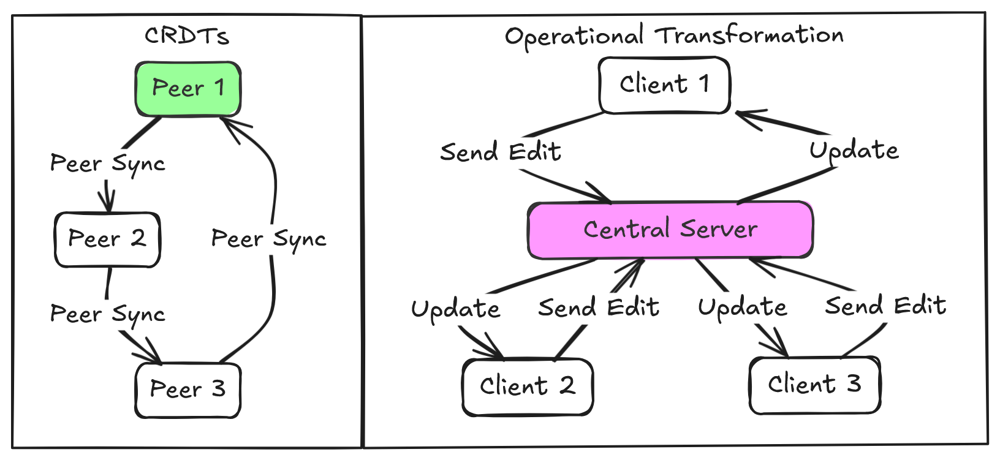

Conflict-free Replicated Data Types or CRDTs are really interesting. The whole decentralized thing is really appealing and just makes something click in my head.

You have probably used google docs. You've had to have wondered how it works so let me spoil you in a vague I only remember half the lyrics kind of way. So a document in google docs takes the input of every user on a document and merges it all together into a single cohesive entry that preserves all information as well as the intent of all users. 

Oh so it's just conflict resolution, you know what would be perfect for that; a data type that facilitates conflict-free merging. Now, I know you thought this was going in a certain direction but google docs doesn't use CRDTs at all. It uses Operational Transformation (OT). OT is that friend who needs plans every minute of a trip, while CRDTs are the ones who say 'we'll figure it out when we get there' and somehow have a better time. OT requires a server to sequence every edit. CRDTs merge chaos into coherence, automatically, anywhere. Resilience > rigid control.


#### Operational Transformation: _"The house always wins"_

Imagine you and I are editing the same sentence in a Google Doc. You delete a word while I’m adding an emoji three lines down. For the doc to make sense, our edits need to _not just merge_ but also _not clobber each other_. OT solves this by requiring a central server to act as a traffic cop. Every keystroke is sent to the server, which lines up operations in a specific order, transforms them to account for concurrent edits, and broadcasts the result. It’s like a group project where one person insists on micromanaging every comma. Effective, but **fragile**. If the server hiccups, the whole system stumbles. You know what doesn't have that problem?

#### CRDTs: _"Whatever works, man"_

You could say that CRDTs skip the drama. They’re designed so that _any two replicas_ of the data can merge automatically, no matter the order. Think of it as a group project where everyone works independently, then slap their individual work together into a Cronenberg monster that somehow makes perfect sense. No central authority, no operation sequencing. Just math ensuring that merging is **associative**, **commutative**, and **idempotent**.  CRDTs do this using metadata which can be used to deterministically decide the final state of the data. So they don't really skip the drama, they actually just bottle it up really well and never let anyone see the pain inside.

For text editing, a CRDT might represent the document as a tree of immutable elements, each tagged with metadata like timestamps or unique client IDs. When two edits collide, the CRDT’s rules deterministically resolve conflicts. Did you delete a paragraph while I bolded it? The CRDT says, “Cool, let’s keep both intentions: the paragraph is gone, but if it ever comes back (via an undo operation), it’ll be bolded.” 

#### Yjs: _The backstage crew_

Yjs is a CRDT implementation. That means that if CRDTs are the _theory_, Yjs is the **practice**. It is a battle-tested toolkit that handles synchronization, conflicts, and distributed chaos so you don’t have to. Yjs fundamentally provides two data types: a map and an array. The former is much easier to implement than latter, for a map CRDT all the metadata you would need is a timestamp. The client machine just decides which of the conflicting entries for a key has a later timestamp and use that entry. 


Now arrays, they are a beast. Most of Yjs' [research paper](https://www.researchgate.net/publication/310212186_Near_Real-Time_Peer-to-Peer_Shared_Editing_on_Extensible_Data_Types) could be summarized as, “Dear God, why are arrays so hard?". Yjs structures arrays as a triply [linked](https://xkcd.comlinked) [list](https://xkcd.com/2483/) (you heard that right). One link for the node after (right), one link for the node before (left), and one link for something I call the intention node (left origin). When a client inserts node _a_ after node _b_ in their local environment, node _b_ is the intention node and is advertised as such in metadata for the rest of time or until node _b_ is deleted. Yjs ensures a few things, and take my word for it that it works:

- A node is always between its intention node and its right linked node.
- The links of any two nodes back to their intention node never cross.

Turns out, the monumental amount of work you have to do to facilitate this is all you need for implementing Yjs' approach to arrays.

Yjs also provides a text data type, which is just a fancier array, and an xml data type, which is just a fancy combination of arrays and maps. You know what Yjs doesn't have?

#### Trees: _Actually not that hard (If you are Evan Wallace)_

So Yjs doesn’t have trees. But here’s the good news, all you need to is to put a trench coat on a map to make a tree. The correct or boring way to say this would be that you represent a tree as a parent array. Anyways, enter [Evan’s CRDT Mutable Tree Hierarchy](https://madebyevan.com/algos/crdt-mutable-tree-hierarchy/), the algorithm that asks, “What if trees… but with _**receipts**_?”. The approach can be boiled down to this:

- Every node keeps a stack of past parents (the parent history).
- If two users try to create a loop (A → B → A), the CRDT picks a winner from the parent history using timestamps or client IDs. This is done by going down the parent history until a suitable parent is found.

### yjs-orderedtree: _Y.Maps in a trenchcoat_

For Evan's algorithm to work, the parent history of every node in the tree must be synchronized with all clients. A map CRDT can be used here. So each node in the tree CRDT needs to consist of the following:

- A value (duh)
- A Y.Map that holds parent history, with the parent node ID as a key and an object containing:
  - `position`: An integer representing how many move operations ago this parent was valid.
  - `orderIndex`: A fractional number (stored as a string) to resolve sibling ordering.


<style jsx>{`
  .responsive-img {
    width: 100%;
    max-width: 300px;
    height: auto;
    margin: 1rem auto 1rem auto;
    float: center;

    /* On small screens, no float */
  }
  @media (min-width: 768px) {
    .responsive-img {
      margin: 1rem 1rem 1rem 0;
      float: left;
    }
  }
`}</style>

Now what if you want the nodes to be ordered, dare I say like an ordered tree data structure. To define a node and it's siblings in an order, we have to assign the node and it's siblings an order index integer. There are several problems to be dealt with here though:

- Problem 1: What happens when a client wants to insert node C between node A (order index: 2) and node B (order index: 3)? There’s no integer between 2 and 3.
- Problem 2: Two clients create nodes offline with the same order index.

The first situation can be solved by utilizing fractional indexing. The order index should be a floating point number, not an integer. But if you think about it, there's not that many move operations a node can undergo before the floating point order index has reached the maximum digits a float can be. (Insert a node between 0 and 1, it's index would be 0.5, then a node between 0.5 and 1, index would be 0.25 and so on until 17 digits are reached and Javascript can't hold any more decimal digits). This is why we represent floating point number not as a number but as a string. Strings transcend the limitation that numbers in javascript face and are perfect for this.


That still doesn't solve the second situation, and if you are fan of bogo sort like me then you will definitely like how this second situation is solved. One word and five syllables, you guessed it; Randomization. You randomize the order index of node C being inserted between node A and B to be any fractional number between the order indexes of A and B.

Summarizing:

- Solution 1: Use fractional indexing. Represent order indexes as strings (e.g., `"2.5"`), sidestepping JavaScript’s floating-point precision limits.
- Solution 2: Randomization. When inserting between two nodes, generate a random fractional string (e.g., `0.75026` between `0.5` and `1`).

Now all that's left to do is to store a node's order index. For convenience we can store this is the parent history array. A node's order index under a parent node id is stored in a consolidated object alongside the parent's position integer, so the parent history map would look like this for a node:

```javascript
node.parentHistory = {
    "parentId1" : {position: 0, orderIndex: 0.75026},
    "parentId2" : {position: 1, orderIndex: 0.25002},
    .
    .
    . and so on
    .
}
```

And this everything that yjs-orderedtree does to provide a tree CRDT. It holds all nodes in a Y.Map, and each node itself is a Y.Map with two entries with these keys:

- value : value is any object/primitive

- parentHistory :  A Y.Map that is structured like this

```javascript
{
    "parentId1" : {position: 0, orderIndex: 0.75026},
    "parentId2" : {position: 1, orderIndex: 0.25002},
    .
    .
    . and so on
    .
}
```

See it in action here: [https://yjs-orderedtree-react-example.vercel.app/](https://yjs-orderedtree-react-example.vercel.app/)

Go ahead, pause and unpause synchronization and create/move around nodes as you see fit. Try creating cycles as well. It will handle everything

So there you have it: yjs-orderedtree combines Evan’s tree hierarchy and fractional indexing with Yjs’ battle-tested synchronization. No matter where the clients go and no matter what they do, they always agree with each other when they are back together like they were never apart for a second.

#### _Final Thoughts_

CRDTs aren’t magic, they’re math with better PR.

You can find the npm package here: [https://www.npmjs.com/package/yjs-orderedtree](https://www.npmjs.com/package/yjs-orderedtree)

You can find the repository here: [https://github.com/Tulip-Writer/yjs-orderedtree](https://github.com/Tulip-Writer/yjs-orderedtree)

You can find the code for the demo here: [https://github.com/Yeshan-K/yjs-orderedtree-react-example](https://github.com/Yeshan-K/yjs-orderedtree-react-example)
